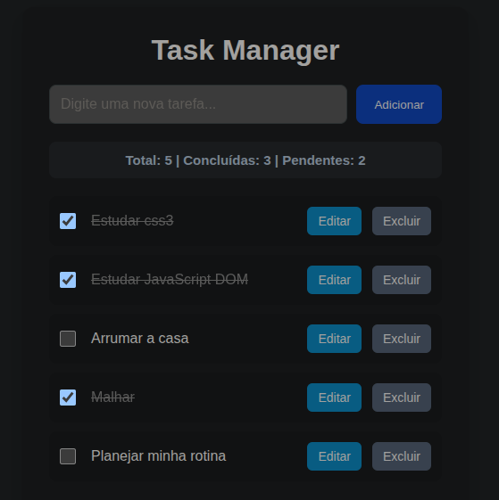

# Task Manager

Gerenciador de tarefas desenvolvido com HTML, CSS e JavaScript.

## Funcionalidades

- Adicionar novas tarefas
- Marcar tarefas como concluídas
- Editar tarefas
- Excluir tarefas
- Contador de tarefas concluídas e pendentes
- Salvamento automático com LocalStorage

## Tecnologias utilizadas

- HTML5
- CSS3
- JavaScript

## Objetivo

Projeto desenvolvido para praticar manipulação do DOM, eventos em JavaScript e armazenamento de dados utilizando LocalStorage.
